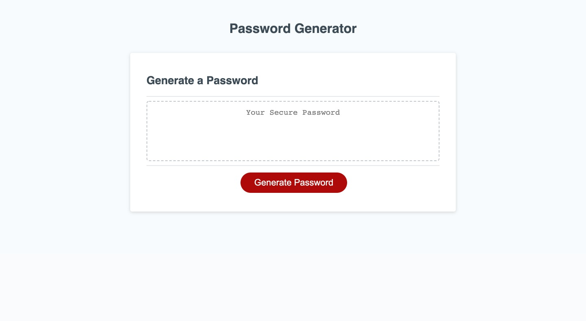

# Password Generator

## Introduction
This page is intended to create a password using the desired length by the user as well as the desired types of characters.

[Link to password generator](https://jpecheverryp.github.io/password-generator/)

## Types of characters available
The user can choose between 8 and 128 characters and they can be either
- Lowercase letters
- Uppercase letters
- Numbers
- Symbols

## Validations on the page
The page knows when a user selected a number lower than 8, higher than 128, or when a not numerical value was selected.
The page also creates a password only if there is at least one type of character available to create it.
